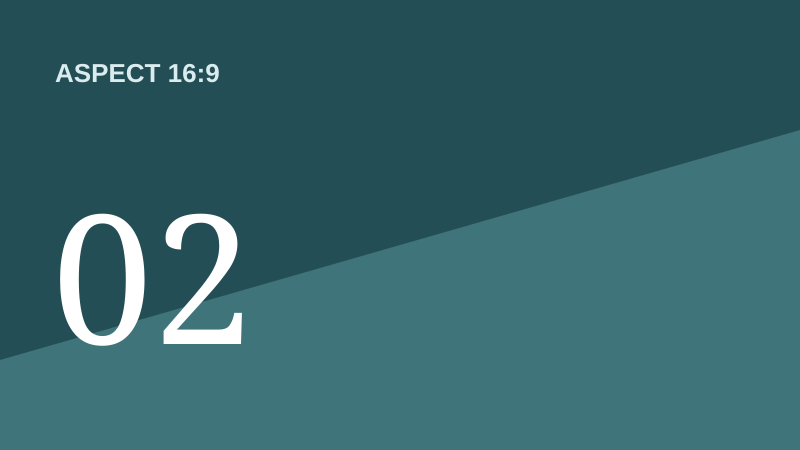
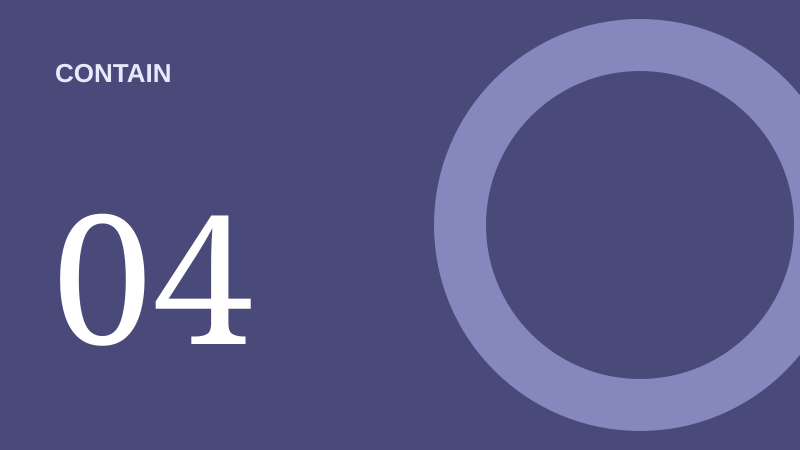
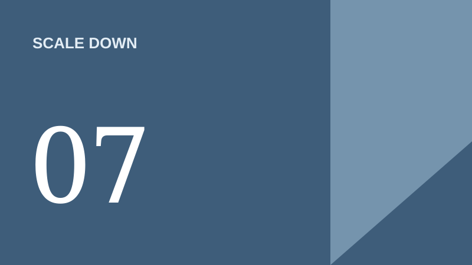
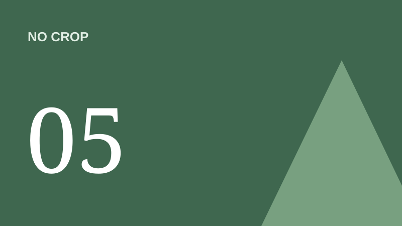

# Visual Review Workshop

A structured comparison of direction, consistency, and readiness

## One direction gets the full canvas

## Two finalists make comparison direct

## Three directions make the trade-offs visible

## Five states expose consistency issues

## One rubric separates preference from quality

| Criterion | Review question |
| --- | --- |
| Hierarchy | Is the main point obvious within a few seconds? |
| Legibility | Does the content remain readable at presentation distance? |
| Consistency | Do repeated elements behave predictably? |
| Flexibility | Can the system handle short and dense material? |

### Discuss evidence before solutions

Describe what is working or failing, identify the consequence, and only then propose a change.

---

The strongest direction is not necessarily the most decorative one. It is the direction that communicates reliably across the full set of states.

- Preserve decisions that improve comprehension
- Revisit choices that only work in one composition
- Record unresolved questions for the next review

# Decision

Converge on a direction, not a finished design.

## End with an explicit next step

The review should conclude with one selected direction, a short list of required changes, and an owner for the next iteration.
